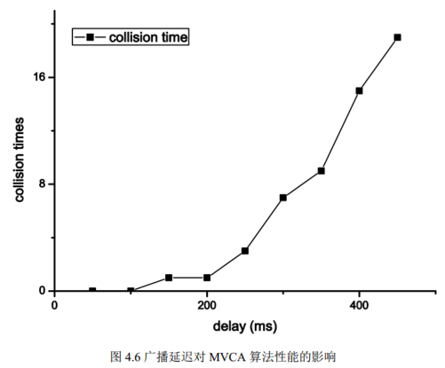

# 自主类车机器人躲避算法研究(史飞学长硕士论文)

[TOC]

---

# 一、概论
>在这主要关注本文介绍的通信性能对轨迹规划的影响，以及学长的实际研究方法。

## 障碍物检测

>介绍了三种障碍物检测方法

可以分为两类，基于传感器的，基于车间通讯的。主要目的是引入车间通信对障碍物检测的不可或缺性。
*ITS facility layer 中定义了 **Cooperative Awareness Message(CAM)**和 **Decentralized Environmental Notification Message(DENM)**两种消息*

通过这两种方式来提高车辆感知的能力，确保安全性。

---
# 二、常用路径规划方法

## 1. 图搜索方法
>比较经典的算法，在这照搬一下师兄的介绍

如果机器人的自由度为 n，那么该机器人应该存在一个 n 维的配置空间，通常简写为C-space。 C-space 中排除障碍物的安全部分可以被表示为 C-free。 图搜索类方法是一类
非常经典的算法，它主要通过生成各种曲线来连通整个 C-free。当在 C-free 中构造了适
当的曲线之后， 整个 C-free 就成为了一张连通图。 可以用一些方法来寻找最短的安全路径，如 Dijkstra 算法。多数图搜索类方法被应用于静态的路径规划问题，即假设障碍物
都是静止的。 
**图搜索方法的缺点**在于： 需要提前获得整个环境的全局信息。另外， 随着机器人的自由度增加，构造图的时间复杂度也会快速扩张。图搜索类方法主要包括可视图法，切线图法，和 Voronoi 图法。

1.1 可视图法

1.2 Voronoi 图法

---
## 2. 栅格法

栅格法是将机器人的配置空间 C-Space 递归分解为较小的栅格，所有栅格(cell)是
相互联接且不重复的,这种方法十分适合计算机表示周围的环境信息，栅格法往往配合
图搜索方法结合使用

---

## 3. 传统方法

3.1 人工势场方法

3.2 模糊逻辑方法

---

## 4. 智能方法

4.1 人工神经网络方法

4.2 遗传算法

---

## 5. 总结

> 首先介绍多车轨迹规划算法，本文使用分布式

将单车的轨迹规划算法应用到多车当中，这个过程中需要考虑系统的实用性问题。目前已有的**多车轨迹规划方法**可以大致分为中心式和分布式。

- 中心式轨迹规划算法

假设存在一个计算能力很强的中心节点为所有类车机器人规划轨迹。当机器人数量增长，中心节点的计算开销也迅速增长，同时控制指令从中心节点发送给机器人还需要一定时延。一旦中心节点故障，系统瘫痪。

- 分布式轨迹规划算法

相比于中心式的规划算法，分布式算法更易实时对未知和动态的环境变化做出相应，而且通常具有更高的可靠性，
可扩展性，适应性，和鲁棒性，但是得到的解可能是次优的 

>其次，目标是尽可能减少每个个体之间的信息量

确定采用分布式算法后，下一步需要考虑的是多车躲避时交换的信息量问题。过多会导致竞争信道带来的帧碰撞。因此尽可能减少交换的信息量。

> 综上，希望获得一种**分布式的，交换信息量尽可能少的**分布式实时轨迹规划算法

本文在 A*算法的基础上设计了一个全局导航算法。该算法用于帮助自主类车机器人寻路；提出一种能够使多个自主类车机器人互相躲避的分布式实时轨迹规划算法(Multiple Vehicle Collision Avoid, `MVCA`) 

算法基于应用于完整型机器人的 `Reciprocal n-body Collision Avoidance` 算法改进得到。 该算法的优势在于允许每个类车机器人都可以独立自主地决定它们的目的地和控制量输入，而不需要彼此协商。这大大节省 `VANET`的有限带宽。 

---

# 三、自主类车机器人躲避算法MVCA

## 1. 概览

> 对于轨迹规划算法进行简单介绍

轨迹规划 = 全局轨迹规划 + 局部轨迹规划

- 全局轨迹规划：使类车机器人找到到达目的地的**全局最优路径**
- 局部路径规划：使类车机器人**对周围交通流作出反应**，躲避其它类车机器人

类车机器人是**典型的非完整系统**，需要考虑类车机器人的非完整性运动学约束

---

## 2. 类车机器人的轨迹跟踪

> 主要介绍了动力学和车体运动学的知识

### 2.1 类车机器人的运动学

进而得到车辆的运动学方程：

---

### 2.2 类车机器人的轨迹跟踪

> 主要通过公式进行车辆的运动学约束

---

### 2.3 轨迹的旋转

---

### 2.4 仿真实验

---

## 3. 全局规划算法

> 主要介绍A*算法的应用

A\*算法是一种在静态路网中求解最短路最有效的直接搜索方法。 A*算法使用一个启发式函数控制算法的搜索方向。计算公式是：$ f(n) = g(n) + h(n) $

---

## 4. 局部规划算法

> 主要介绍ORCA(Optimal Reciprocal n-body Collision Avoidance)算法
>
> ***最佳互补n个体碰撞避免***，解决同时存在多个智能体和障碍物，如何令它们之间互相躲避

### 4.1 Velocity Obstacle(速度障碍)

> 考虑多个类车机器人互相躲避问题，不能仅仅依靠坐标来表示障碍物，因为障碍物不总是静止的。
>
> 提出**速度障碍**概念，表示运动的障碍物

---

### 4.2 Optimal reciprocal collision avoidance

> 正式开始介绍`ORCA`，基于上一小节内容进行整理
>
> 仍然都是数学公式解释。。。

---

### 4.3 多个类车机器人的躲避

> 个体A感知周围其他机器人，进而得到一个速度区间，在区间中选择离全局规划速度最近的速度进行改变

---

### 4.4 对于静止的障碍物的躲避

> 考虑静止障碍物问题，其速度为0，有一定区别

---

### 4.5 对于运动的障碍物的躲避

---

## 5. 仿真实验

> 使用C++和MATLAB进行仿真

### 5.1 类车机器人跟踪算法的仿真

### 5.2 多个类车机器人躲避算法的仿真

> 规定好约束，分别仿真十字路口场景和圆形交换位置

​										十字路口场景仿真

​										圆形交换位置的仿真

---

# 四、基于车间通讯的应用环境的仿真实验

> **重点！！！**

## 1. 基于802.11p的通信

> **之前的实验基于一个很强的假设，即：所有其他类车机器人的外在状态信息都能被精确感知。**
>
> *在此研究：车间通讯引入的**不确定性**对轨迹规划的影响*

**基础知识：**

IEEE `802.11p` 是 IEEE `802.11a` 的变体，以适应车-X 通讯所需要的高度动态的移动环境和 ad hoc 传输方式。 IEEE `802.11p` 将信道划分为两类：**服务信道(`SCH`)和控制信道(`CCH`)**，控制信道会负责发送车辆状态广播 `CAM`(如位置，加速度等)和安全性广播`DENM`(急刹车，前方危险预警等)。由于 `DENM` 消息是由事件触发的，所以我们使用时间触发的周期性状态广播 `CAM` 消息感知交通流，并且需要针对车载自组网下的 `CAM` 广播建立模型。 

---

## 2. 类车机器人的轨迹预测

> `CAM`包不可避免会出现**延迟和丢包**，使得我们感知到的信息常常都是滞后的

在这我们主要计算CAM包丢包的情况下，车辆的向前运动距离。

---

## 3. 仿真实验

使用的物理量：

通过C++实现CAM消息的收发过程模拟，得到延迟和丢包率。

***通过更改延迟来观察碰撞率。在延迟小于 100ms 的情况下并没有碰撞发生，当延迟增大到 300ms 以上时， 碰撞次数急剧增加。延迟 300ms 即意味着只有 300ms 之前已经发送的包才能够被接收并且用于估计***

